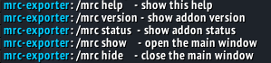

# Raidwise

WoW addon for **Wrath of the Lich King 3.3.5a** (`Interface: 30300`).


## Install

1. Copy the `Raidwise` folder into your client’s AddOns directory:

   ```text
   <WoW>/Interface/AddOns/Raidwise/
   ```

2. Restart the client (or `/reload`).
3. Enable **Raidwise** on the character select AddOns screen if needed.
4. If you previously used **mrc-exporter**, remove that folder from AddOns so only Raidwise loads.


## Usage

In-game slash commands:

| Command | Description |
|---------|-------------|
| `/raidwise` or `/rw` (also `help`) | Show help |
| `/raidwise version` | Show addon version |
| `/raidwise status` | Show load status |
| `/raidwise show` | Open the main window |
| `/raidwise hide` | Close the main window |

The window uses a Details-style layout: plain panels, a **left menu**, and a content page. The status bar shows the addon name and version. Esc or the title **X** closes the window.

**Character cooldowns** tab:

- Table of raid and dungeon lockouts for every character saved on this account
- First column is the instance name and type (10 / 10 Heroic / 25 / 25 Heroic, plus older 20 and 40)
- Other columns are characters (class-colored name and spec icon); log in on each alt to record them
- Saved cells show time remaining until reset

**Party roster** tab:

- Table of the current 5-player party (you alone when not grouped)
- Line above the table: average item level and average GearScore
- Columns: name, class icon, spec icon, GearScore, average item level, karma, tags, guild with rank
- **Refresh** re-scans GearScore and re-inspects nearby members for spec updates

**Raid roster** tab:

- Two blocks: raid groups **1–5**, then **6–8**
- Line above the cells: average item level and average GearScore
- Each group is a column of five player cards: class icon + name, spec icon + GS/iLvl, karma, and tags
- Click a filled card to open **Character profile** (`{name} - Character profile`)
- **Refresh** re-scans GearScore and re-inspects nearby members for spec icons

**Export gear and CDs** tab:

- Short description, then **Include item names**
- **Export character data** fills the JSON box (name, class, spec, gearScore, gear, bags, lockouts)
- **Select all** highlights the JSON for Ctrl+C
- `gearScore` comes from the **GearScore** addon when it is installed (optional dependency)

**Export cooldowns** tab:

- **Export cooldowns** fills a JSON box with every stored character and their current lockouts (`exportedAt`, `characters[]`)
- **Select all** highlights the JSON for Ctrl+C

**Info** tab:

- What the addon exports and which slash commands exist
- Repository URL in a copy box with **Select all** (Ctrl+C)

View layouts: [`docs/UI-Views.md`](docs/UI-Views.md). Pixel sizes: [`docs/UI-Sizes.md`](docs/UI-Sizes.md).

Consumers can type the export JSON with `types/CharacterExport.ts` and `types/CooldownsExport.ts`.

## Screenshots:
Main addon view (`/raidwise show`):


In-chat menu (`/raidwise help`):



# Development

## Layout

```text
Raidwise/
  Raidwise.toc        # addon metadata (Interface 30300)
  Raidwise.lua        # entry point, events, slash commands
  CharacterExport.lua # character JSON export (gear, bags, lockouts)
  CharacterLockouts.lua # account-wide lockout snapshots for the cooldowns table
  PartyRoster.lua     # party / raid member stats for roster views
  ExporterWindow.lua  # main in-game window
docs/
  UI-Views.md         # ASCII layouts for each view
  UI-Sizes.md         # window / control pixel sizes
types/
  CharacterExport.ts  # TypeScript types for the character export JSON
  CooldownsExport.ts  # TypeScript types for the account cooldown export JSON
```

## Notes

- Target build: **3.3.5a** (private-server style clients use `## Interface: 30300`).
- Saved variables are stored in `RaidwiseDB` (`WTF/Account/.../SavedVariables/`). Settings from the old `MrcExporterDB` are migrated on first load. Per-character lockouts for the cooldowns table live in `RaidwiseDB.characters`.
- `## X-LastUpdated` in the `.toc` is set manually; keep the README badge in sync.
- Optional dependency: **GearScore** (`## OptionalDeps`) for the `gearScore` export field.
