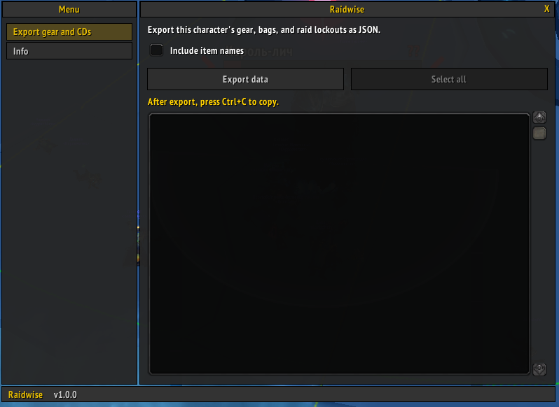

[English](README.md) | [Русский](README.ru.md)

# Raidwise

Raid-prep addon for **Wrath of the Lich King 3.3.5a** (`Interface: 30300`): party and raid rosters, raid composition checklist, player ratings, meeting history, account-wide lockouts, and character JSON export.


## Install

1. Copy the `Raidwise` folder into your client’s AddOns directory:

   ```text
   <WoW>/Interface/AddOns/Raidwise/
   ```

2. Restart the client (or `/reload`).
3. Enable **Raidwise** on the character select AddOns screen if needed.
4. If you previously used **mrc-exporter**, remove that folder from AddOns so only Raidwise loads.


## Usage

In-game slash commands:

| Command | Description |
|---------|-------------|
| `/raidwise` or `/rw` | Open the main window |
| `/raidwise close` or `/rw close` | Close the main window |
| `/raidwise gearcheck` or `/rw gearcheck` | Open Gear check (target) and scan |
| `/rw gearcheck summary` (also `items`, `enchants`, `gems`, `ok`) | Print that report to your chat (scans first if needed) |
| `/rw gearcheck raid dump` | Open Raid roster and show the last raid gear-check dump for copy |
| `/rw gearcheck test` | Offline rules self-test |

Plain panels, a **left menu** grouped as Personal / Raiding / Other, and a content page.
The menu title bar shows **Raidwise** and the addon version.
Esc or the title **X** closes the window.

**Character cooldowns** tab:

- Table of raid and dungeon lockouts for every character saved on this account
- First column is the instance name and kind (`(Raid)` / `(Dungeon)`); size and mode live in character cells
- Other columns are characters (class-colored name, spec icon, and last check time); log in on each alt to record them
- **Remove** on non-current character columns drops that alt from the table (login again restores it)
- Saved cells show size/mode tags (`10`, `10h`, `25`, `25h`; heroic in red); hover for time until reset
- **Currency** row at the bottom: labels with account totals in the first column; each character column shows icon + quantity for gold, emblems, honor/arena, and other tokens (from the in-game Currency tab)

**Export gear and CDs** tab:

- Short description, then **Include item names**
- **Export character data** fills the JSON box (name, class, spec, gearScore, gear, bags, lockouts)
- **Select all** highlights the JSON for Ctrl+C
- `gearScore` comes from the **GearScore** addon when it is installed (optional dependency)

**Raid roster** tab:

- Two blocks: raid groups **1–5**, then **6–8**; when not in a raid, your party fills group 1
- Lines above the grid: five-column header (description, grade legend, GS averages, flask/food/armor/ench with note icons, Scan/Export all/Refresh/Back to roster); then scan status and progress
- Each player card: class + name, flask/food status icons, role + spec + GS/iLvl, raid-buff icons, personal opinion line, armor/weap and ench/sock grades, **Profile** / **Gear** / **Rescan**
- Hover a card for opinion, tags, **guild (rank)**, and gear-check details
- **Scan** / **Export all** for raid-wide gear check; **Export all** opens copy text; **Back to roster** closes it; click the dump + Ctrl+C to copy
- **Refresh** re-scans GearScore and re-inspects nearby members for spec icons
- Card click opens **Character profile**

**Raid composition** tab:

- Checklist of the current party or raid (solo uses only you)
- Top band: **Roles** and all 10 **Classes** with counts; then sections: Aggro, buffs, external buffs, damage reduction, debuffs, mana regeneration, health regeneration
- Gold rows are covered; dim rows are missing. Section titles show present/total (red when nothing in the section is present)
- Hover a row for who has it and which class/spec brings which spell; **Shift-click** posts that effect to raid/party chat
- **Report missing** posts absent classes to raid or party chat; **Refresh** re-reads the group (same inspect path as Raid roster)
- Full tracking list: [`docs/Raid-Composition.md`](docs/Raid-Composition.md)

**Gear check (target)** tab:

- **Scan** evaluates target or self (Overall GOOD / OK / REPLACE / BAD, class/spec icons, GS/iLvl, findings by filter: All / Items / Enchants / Gems / OK)
- Spec ranks: **preferred** / **acceptable** / **unwanted** / **forbidden** (map to GOOD / OK / REPLACE / BAD)
- **Report …** buttons and `/rw gearcheck summary|items|enchants|gems|ok` print to **your chat only**
- **Show as a text** toggles the raw dump; **Save report** keeps a snapshot (~14 days)
- Surface-level disclaimer; rules and known false positives: [`docs/Gear-Check-Progress.md`](docs/Gear-Check-Progress.md)
- `/rw gearcheck` opens this tab and scans; `/rw gearcheck test` runs the offline self-test

**History** tab:

- Table of players you have been in a party or raid with (saved in `RaidwiseDB.history`, survives logout)
- Columns: name, class icon, spec icon, personal opinion, tags, GearScore, iLvl, where you met, when, guild
- Click a row to open **Character profile** (includes GUID, meeting zone, time, and realm)
- **Refresh** records the current group again and redraws the list

**Player rating** in Character profile:

- Tabs: **History**, **Edit note**, **Facts**, **Events**, **Memo** — **History** opens by default
- On **Edit note**, set **Positive** / **Neutral** / **Negative** and personal tags (up to 3 per category); **Save and Update** commits opinion, tags, facts, and events
- On **Facts**, set role / identity facts (up to 4)
- Profile **History** shows **Met**, **Was in the same party**, and a changelog with icons
- On **Events**, pick a type by category (**Attendance**, **Loot**, **Help**, **Behavior** — each with an icon) and **Add event** / **Remove** (draft until **Save and Update**; context captured when adding). Joining a party or raid also logs **In the same party** when the meet count goes up (first meet, or ≥30 minutes since last seen)
- On **Memo**, write a private free-form note with **Save** / **Reset** (not shared, not logged in History)
- Raid and History show your saved opinion and tag summary; click a row or card to open the profile
- **Community note** is currently a mock preview for a future addon exchange / web app feature

**Settings** tab:

- Interface language: **English** or **Русский**
- The choice is saved on this account (`RaidwiseDB.locale`); a Russian client defaults to Russian
- **Startup page**: which left-menu tab opens on `/raidwise` (`RaidwiseDB.startupTab`; default Character cooldowns; **Info** cannot be selected)
- Unit tooltip toggles: hide personal opinion / personal tags / community rating / community tags (`RaidwiseDB.tooltip`)
- Preview of compact (live) and stacked tooltip layouts

**Info** tab:

- About overview (one sentence per line, with lists) plus per-menu feature sections (same icons as the left menu, each with that view’s layout `vN`)
- Repository URL in a copy box with **Select all** (Ctrl+C)

View layouts: [`docs/UI-Views.md`](docs/UI-Views.md). Pixel sizes: [`docs/UI-Sizes.md`](docs/UI-Sizes.md). Reputation model: [`docs/Reputation.md`](docs/Reputation.md). Composition tracking: [`docs/Raid-Composition.md`](docs/Raid-Composition.md).

Consumers can type the Export-tab JSON with `types/CharacterExport.ts`. `types/CooldownsExport.ts` describes the account-wide cooldown JSON shape (from `FormatCooldownsExport`; not wired to a UI button yet). `types/GearCheck.ts` describes the Gear Check normalized report (`schemaVersion` 2).

## Screenshots

Main addon view (`/raidwise`):



# Development

## Layout

```text
Raidwise/
  Raidwise.toc        # addon metadata (Interface 30300)
  Raidwise.lua        # entry point, events, slash commands
  Locale.lua          # English / Russian UI strings and language switch
  CharacterExport.lua # character JSON export (gear, bags, lockouts)
  CharacterLockouts.lua # account-wide lockout snapshots for the cooldowns table
  PartyRoster.lua     # party / raid member stats for roster views
  RaidRoles.lua       # raid role and spec/race buff lookups
  RaidComposition.lua # party/raid buff, debuff, and utility coverage
  PlayerHistory.lua   # saved party/raid encounter list + personal ratings
  UnitTooltips.lua    # personal/community lines on player unit tooltips
  UIWidgets.lua       # shared panels, buttons, icons, layout version badges
  CharacterProfile.lua # Character profile window (opinion, tags, notes, history)
  GearCheckCatalog.lua # enchant / gem seed catalogs
  GearCheckSets.lua   # T9/T10 set-piece ids (informational)
  GearCheckTrinkets.lua # preferred/allowed trinket pools by role
  GearCheckProfiles.lua # class + 30-spec Gear Check profiles
  GearCheckRules.lua  # findings + verdicts + overall + offline self-test
  GearCheckSavedReports.lua # manual save / load / prune (~14 days)
  GearCheck.lua       # collector + normalize (schemaVersion 2) + evaluate + dump
  PageCooldowns.lua   # Character cooldowns tab
  PageExport.lua      # Export gear and CDs tab
  PageRaid.lua        # Raid roster tab
  PageComposition.lua # Raid composition tab
  PageGearCheckTarget.lua # Gear check (target) tab
  PageHistory.lua     # History tab
  PageSettings.lua    # Settings tab
  PageInfo.lua        # Info tab
  ExporterWindow.lua  # main window shell (menu, title, status, tab wiring)
docs/
  Architecture.md     # TOC order, layers, SavedVariables, refresh API
  UI-Views.md         # ASCII layouts for each view + layout version table
  UI-Sizes.md         # window / control pixel sizes
  Gear-Check-Progress.md # Gear Check phase board (planned / done / test steps)
  Reputation.md       # personal rating / events / memo model
  Raid-Composition.md # classes/specs tracked by the Raid composition tab
types/
  CharacterExport.ts  # TypeScript types for the Export tab JSON
  CooldownsExport.ts  # TypeScript types for account-wide cooldown JSON shape
  GearCheck.ts        # TypeScript types for Gear Check report + findings
```

## Notes

- Target build: **3.3.5a** (private-server style clients use `## Interface: 30300`).
- Saved variables are stored in `RaidwiseDB` (`WTF/Account/.../SavedVariables/`). Settings from the old `MrcExporterDB` are migrated on first load. Per-character lockouts and currency snapshots for the cooldowns table live in `RaidwiseDB.characters` (`.lockouts`, `.currency`). Party and raid encounters live in `RaidwiseDB.history` (keyed by GUID), including personal ratings (`.rating.personal` with opinion/tags/facts), events (`.events`), notes (`.notes`), change log (`.changes`), and party/raid meet count (`.meetCount`). Interface language is `RaidwiseDB.locale` (`enUS` or `ruRU`). Startup left-menu page is `RaidwiseDB.startupTab`. Unit tooltip visibility flags live in `RaidwiseDB.tooltip`.
- `## X-LastUpdated` in the `.toc` is set manually; keep the README badge in sync.
- Optional dependency: **GearScore** (`## OptionalDeps`) for the `gearScore` export field.
